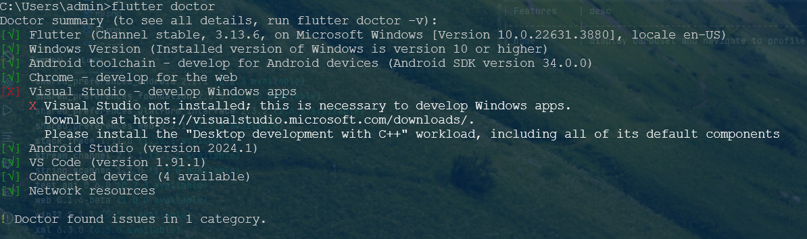

# Flutter Assessment
### Task
######
Make a executable apk with Flutter

Follow the UX/UI on the left side.

Should be same to all deivces with the left images

# FEATURES & IMPLEMENTATIONS
#  1. Set up

--------------------
##  Requirements

--------------------
## Instructions

###### - Ensure you have the above requirements. i.e check using 
        flutter doctor --v
###### -Navigate to project folder and run
        flutter run

### App Features

| Features   | desc                                     |
|------------|------------------------------------------|
| home       | display carousel and navigate to profile |
| profile    | view user profile as in the design       |
| navigation | handles navigation between the 4 tabs    |

### Tech Stack

**Framework:** Flutter (3.13.6)
**Language:** Dart
**State Management:** Provider

### Screenshots

